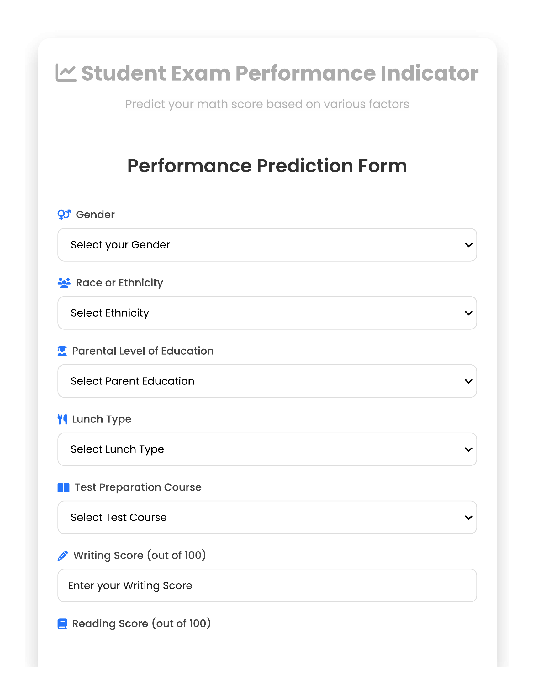

# 🧠 End-to-End Machine Learning Project – Student Exam Performance Indicator

## 🎯 Project Objective
The goal of this project is to **predict the Math Score of students** based on their performance in other subjects and demographic features.  
This project follows a **complete end-to-end machine learning workflow** — from data collection to model deployment.

---

## 🧩 Project Workflow
1. **Data Collection** – Gathered student performance data.  
2. **Data Preprocessing** – Handled missing values, outliers, and categorical variables.  
3. **Exploratory Data Analysis (EDA)** – Visualized relationships between features.  
4. **Feature Engineering** – Encoded and scaled important attributes.  
5. **Model Training** – Trained regression models to predict math scores.  
6. **Evaluation** – Compared models using performance metrics (R², MAE, RMSE).  
7. **Deployment** – Built a Flask web app and deployed it on Render.

---

## 🧰 Tech Stack
- **Programming Language:** Python  
- **Libraries:** NumPy, Pandas, Matplotlib, Seaborn, Scikit-learn, Flask  
- **Version Control:** Git & GitHub  
- **Deployment Platform:** Render  
- **IDE/Tools:** VS Code, Jupyter Notebook

---

## 📊 Dataset
The dataset contains various student features such as:
- Gender  
- Race/Ethnicity  
- Parental Education Level  
- Reading Score  
- Writing Score  
- **Target Variable:** Math Score  

---

## 🧮 Model Building
Multiple regression models were trained and compared:
- Linear Regression  
- Random Forest Regressor  
- Decision Tree Regressor  
- Gradient Boosting Regressor  

The best model was selected based on R² Score and Mean Absolute Error.

---

## 🌐 Website Design

### 🖥️ Home Page


### 📱 Prediction Page


---

## 🚀 Deployment
The project is deployed on **Render**, allowing users to input their details and get a **predicted Math Score** instantly.

---

## ⚙️ How to Run Locally

```bash
# Clone this repository
git clone https://github.com/MazidNawaz/End-to-End-Machine-Learning-Project.git

# Navigate to the project directory
cd End-to-End-Machine-Learning-Project

# Install dependencies
pip install -r requirements.txt

# Run the Flask app
python app.py
```

Then open your browser and visit:
```
http://127.0.0.1:5000/
```

---

## 🧱 Project Structure
```
End-to-End-Machine-Learning-Project/
│
├── data/                      # Dataset files
├── notebooks/                 # Jupyter notebooks for EDA & model training
├── src/                       # Source code modules
├── templates/                 # HTML templates for Flask
├── static/                    # CSS, JS, and images
├── app.py                     # Main Flask app
├── requirements.txt           # Python dependencies
└── README.md                  # Project documentation
```

---

## 👨‍💻 Author
**Mazid Nawaz Ahmad**  
Data Science Enthusiast | Machine Learning Developer  
[GitHub Profile](https://github.com/MazidNawaz)
